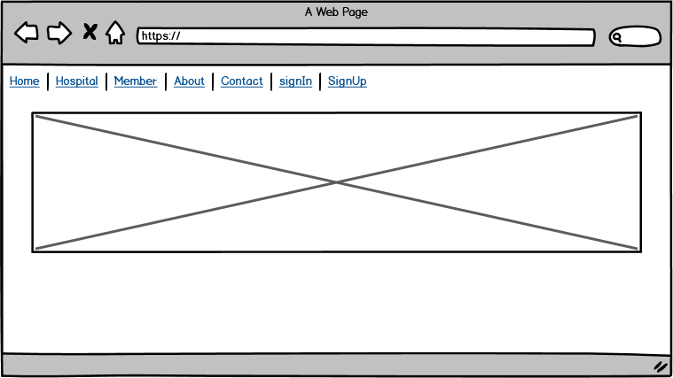

### Project #4: MERN stack app : Life Line

### Deployed link:

## :large_orange_diamond: Life Line
​
Life Line is a blood donation system that collects all hospitals and blood banks in one place.
​
​
### :small_orange_diamond: Technologies:
 #### Used:
 * MERN to create a full stack application
 * Java Script
 * React
 * JSX
 * React-bootstrap 
 * CSS
 * Axios
 * Express
 * MongoDB

​
### :small_orange_diamond: Database:
Two models: 
* Hospitals: Name, location, Email, password, [ member ] >> ref
* Members (Donors + Patients): Name, dateOfBirth,nationality, National Id, BloodType,  type.
​
### :small_orange_diamond: Wireframe:
  

### Features:
* Navigation bar
* Sign up and create a hospital account.
* Sign in and show information.
* Add member: donor and patient.
* Show all members for each hospital.
* Contact us page.
* About Life Line page.
​
​
### :small_orange_diamond: :bust_in_silhouette: User Story
#### :hospital: Hospital: 
  * User can create, edit and delete account.
  * User can add and show members: donors and patients.
​
​
### Favorite part: 
* Collabration 
* React-bootstrap
​
### what to add next?
​* Members can log in and book appointments for donation.
* Use hospitals' api.
* All hospitals can see all donors.